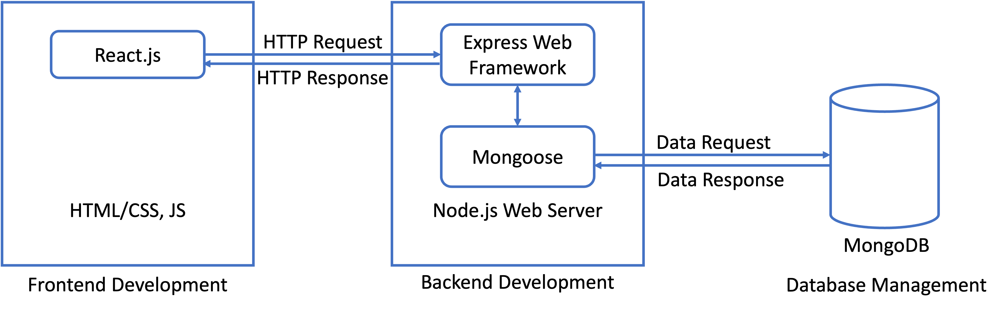
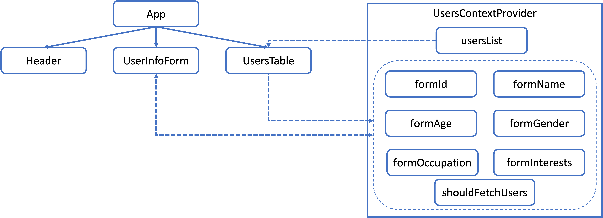
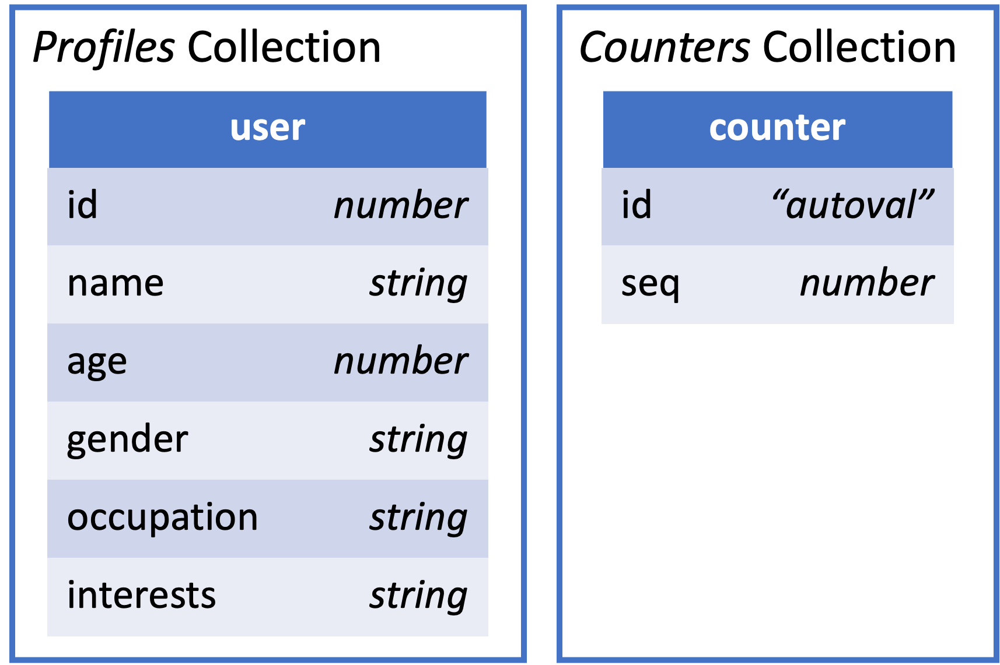
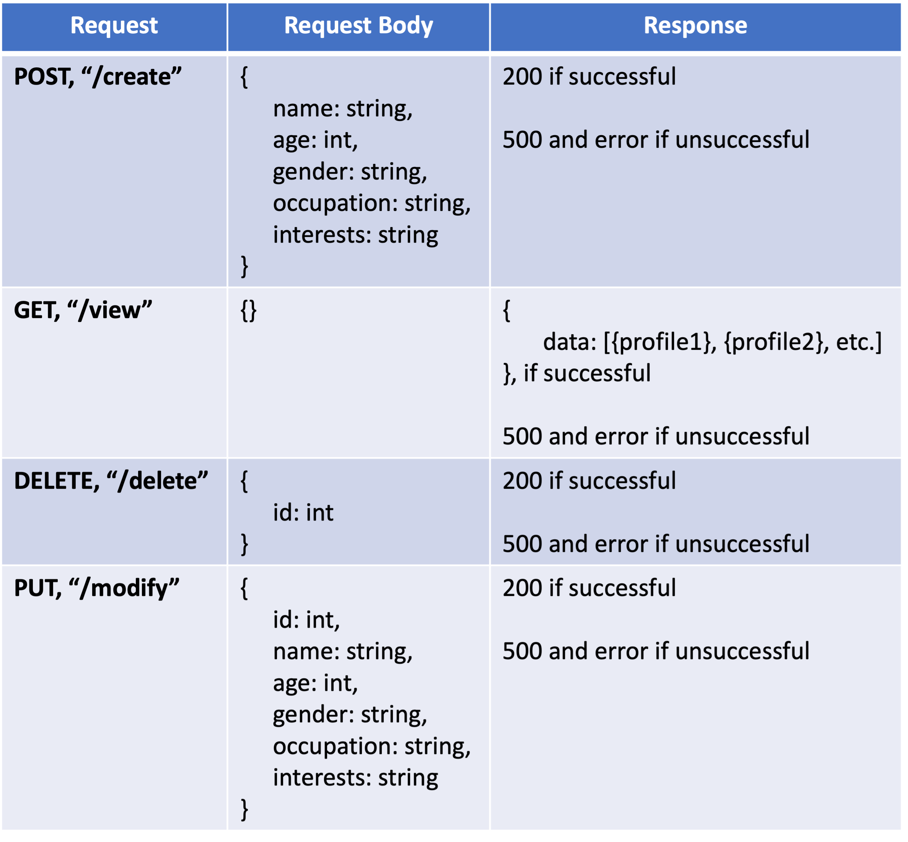

<h1 align="center">
  User-Record Management System
</h1>

The objective of this project is to create a comprehensive user record management system with CRUD (Create, Read, Update, Delete) functionality using the MERN stack. The system is leverages the usage of MongoDB, Express.js, React.js, and Node.js to provide a seamless user experience.

## Quick Start

1. **Prerequisite**

   - ReactJS v18.1.0
   - NodeJS v18.16.0
   - MongoDB Community Edition 6.0

1. **Create the Application**

   Clone the repository

   ```shell
   # Clone the repository
   git clone git@github.com:tienkhoa16/user-records.git
   ```

1. **Install the Dependencies**

   Navigate into your project's root directory and install the necessary dependencies.

   ```shell
   # Navigate to the directory
   cd scripts/

   # Install the dependencies
   ./install_deps.sh
   ```

1. **Run the Application**
   - Start MongoDB locally on port `27017`
   - Start client and server by changing the directory to the `scripts` folder in separated terminals
     - In one terminal `./run_server.sh` to start the Node server at `http://localhost:8000`
     - In another terminal `./run_client.sh` to start the React web application at `http://localhost:3000`
       > If you want to open the `storybook`, you can change the directory to `scripts` in another separated terminal and run `./run_storybook.sh`. The component's stories are at `http://localhost:6006`

## What's Inside?

A quick look at the top-level files and directories included with this project.

    .
    ├── client
        ├── .storybook
        ├── node_modules
        ├── public
        ├── src
        ├── package.json
        ├── yarn.lock
    ├── scripts
    ├── server
        ├── logs
        ├── node_modules
        ├── logger.js
        ├── models.js
        ├── package.json
        ├── server.js
        ├── yarn.lock
    ├── .gitignore
    └── README.md

1. **`client`**: This directory contains all of the code related to the frontend implementation using React.

1. **`scripts`**: This directory contains the scripts for installing dependencies and running the application.

1. **`server`**: This directory contains all of the code related to the backend implementation using Node and Express.

## Overall Architecture

<p align="center">
    
</p>

The architecture depicted in the figure above provides a high-level overview of a web application for managing user profiles. The frontend of the application is implemented using React.js, HTML/CSS, and JavaScript, while the backend is developed using the Express web application framework and the Mongoose object modeling library for MongoDB.

When a user initiates a CRUD operation on their profile, the frontend sends an HTTP request to the backend API, which is then handled by the Express framework. Subsequently, Mongoose interacts with MongoDB to retrieve or modify the data associated with the requested operation. Once the requested operation is completed, Mongoose returns the data response to Express, which constructs an HTTP response and sends it back to the frontend React application.

## Frontend Architecture

<p align="center">
    
</p>

The frontend architecture shown in the above figure comprises three main components:

- `Header`: section titles
- `UserInfoForm`: a form that captures user input for creating and modifying records
- `UsersTable`: a component that renders the list of all current profiles in the database in table format.

The application uses centralized state management to control the states. When the page is loaded, `shouldFetchUsers` is set to `true` to initialize the `usersList` state with the current database records. After all the data is fetched by sending a GET request to the backend, `shouldFetchUsers` is set to `false`. All other states are initially set as empty strings.

When a user creates a new profile, the `formName`, `formAge`, `formGender`, `formOccupation`, and `formInterests` fields are set inside `UserInfoForm` based on the user's inputs. On form submission, `UserInfoForm` sends a POST request to the backend with the request body containing the value of all the form fields. If the request is successful, `shouldFetchUsers` is set to `true` to update `usersList` and re-render `UsersTable`. All the form-related states are reset to empty strings, and `shouldFetchUsers` is set to `false`.

When a user deletes a profile, the `formId` is set by `UsersTable` to identify the record in the database to be deleted. `UsersTable` then sends a DELETE request to the backend with the request body containing `formId`. If the request is successful, `shouldFetchUsers` is set to `true` to update `usersList` and re-render `UsersTable`. Finally, `shouldFetchUsers` is set to `false`.

When a user modifies a profile by clicking the Modify button in `UsersTable`, the `formId`, `formName`, `formAge`, `formGender`, `formOccupation`, and `formInterests` fields are set to the cell values of the corresponding row. `UserInfoForm` re-renders with the newly updated states of these fields, allowing the user to modify all form fields except the read-only `formId`. On form submission, `UserInfoForm` sends a PUT request to the backend with the request body containing the value of all the form fields. If the request is successful, `shouldFetchUsers` is set to `true` to update `usersList` and re-render `UsersTable`. All the form-related states are reset to empty strings, and `shouldFetchUsers` is set to `false`.

## Database and Backend Architecture

<p align="center">
    
</p>

In the `profile-management` database, there are two collections:
- `profiles`: This collection stores all the user profile documents.
- `counters`: This collection stores the sequence number of the documents added to the `profiles` collection. Upon receiving a POST request, `seq` value will be automatically incremented by 1. This `seq` value is then used to auto-assign an ID to each profile created in the `profiles` collection.

<p align="center">
    
</p>

The table above provides a description of the REST API interface that connects the frontend and the backend of the application.

When the frontend sends a POST request to the backend to create a new user profile, the backend auto-increments the `seq` field in the `counters` collection of the database to assign a unique `id` to the profile. The document is then saved to the `profiles` collection. If the operation is successful, the backend responds with a status code of 200. In case of an error, the backend responds with a status code of 500.

A GET request to the backend is used to retrieve all the documents in the `profiles` collection. If the operation is successful, the backend sends a response containing a list of all the user profiles in the `data` field. In case of an error, the backend responds with a status code of 500.

When the frontend sends a DELETE request to the backend, the backend sends a request to delete the document in the `profiles` collection that matches the `id` provided in the request body. If the operation is successful, the backend responds with a status code of 200. In case of an error, the backend responds with a status code of 500.

If the frontend sends a PUT request to the backend to update an existing document in the `profiles` collection, the backend sends a request to update the document that matches the `id` field provided in the request body. If there is a match, the corresponding document will be updated with the fields provided in the request body. If the operation is successful, the backend responds with a status code of 200. In case of an error, the backend responds with a status code of 500.
